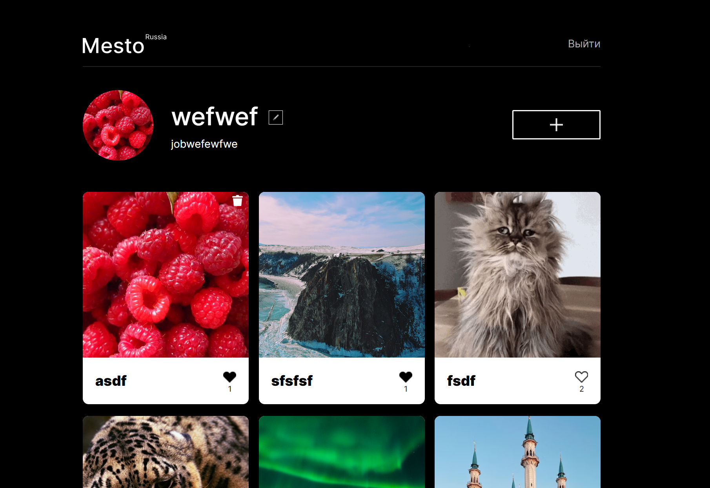
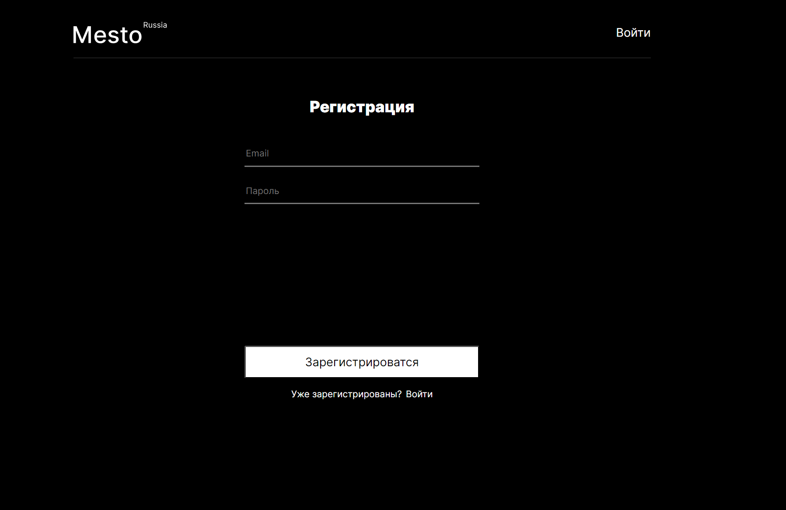
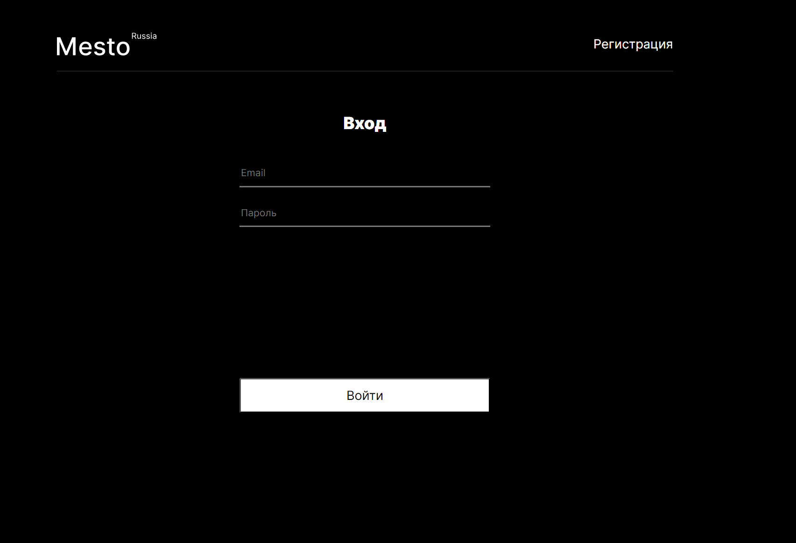

<h1 align="center">Проект "Mesto"</h1>

<h2 align="center">Стек</h2>

---

<h2 align="center">Ссылка на демо</h2>

https://ivanfedoruschenko.github.io/react-mesto-auth/

---

<h2 align="center">Описание</h2>

Проект позволяет размещать картинки в общей базе. Предусмотрена возможность постановки лайка/дислайка, а также удаления своих карточек.

 При клике на картинку, она открывается в исходном размере.
Для получения доступа к основному разделу необходимо пройти регистрацию и авторизацию.

При повторном открытии приложения, вход не требуется.

---

<h2 align="center">Инструкция</h2>

Для развертывания проекта необходимо клонировать репозиторий. В консоли ввести команду npm i

Для запуска проекта использовать npm start

В случае появления ошибок в консоли, ввести:

-npm start --no-audit

---

<h2 align="center">Планы по доработке</h2>

В дальнейшем планиурется провести рефакторинг кода, в целях устранения дублирования кода. Также планируется добавить валидацию форм, сортировку карточек по количеству.

